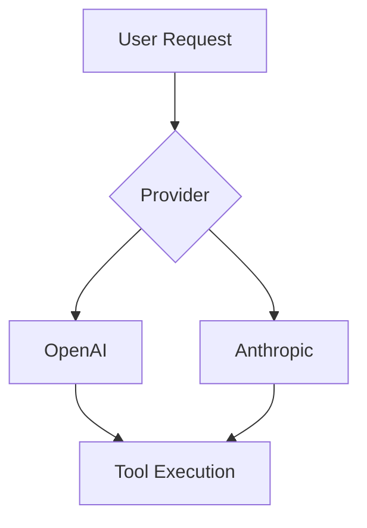

# Composio PR

Create GitHub pull requests for the Composio SDK with conventional commit titles and structured descriptions.

## Workflow

### Step 1: Gather context

Collect information needed to build the PR:

1. Run `git log main..HEAD --oneline` to see all commits on the current branch
2. Run `git diff main...HEAD --stat` to understand which files and packages changed
3. Run `git diff main...HEAD` to read the actual changes
4. Check the branch name for clues (e.g., `fix/gemini`, `feat/e2e-tests-deno`)
5. Ask the user for the Linear issue ID if not obvious from branch name or commits

### Step 2: Determine the PR title

Build a conventional commit title following this format:

```
<type>(<scope>): <short imperative description>
```

**Type** (pick one):
- `feat` — new feature or capability
- `fix` — bug fix
- `refactor` — code restructuring without behavior change
- `chore` — maintenance, deps, CI, tooling
- `docs` — documentation only
- `test` — adding or fixing tests
- `perf` — performance improvement

**Scope** — the package or area affected:
- `ts/core` or just `core` — core TypeScript SDK
- `ts/e2e` — TypeScript e2e tests
- `py` — Python SDK
- `docs` — documentation (fern/)
- Provider names: `openai`, `anthropic`, `langchain`, `vercel`, `google`, `mastra`
- Use the most specific scope that covers all changes

**Description rules:**
- Imperative mood ("add X", not "adds X" or "added X")
- Lowercase after the colon
- No period at the end
- Under 70 characters total
- Use backticks for code references (e.g., `` `connected_account.refresh()` ``)

**Examples:**
- `feat(py): add support for \`connected_account.refresh()\``
- `fix(core): loosen V3 webhook schema to accept any composio.* event type`
- `refactor(ts/e2e): remove deprecated \`nodeVersions\` property`
- `feat(ts/e2e): add Node.js e2e test about file roundtrip`

### Step 3: Write the PR description

The description follows a strict structure. See `references/pr_examples.md` for real examples from merged PRs.

#### Opening line

Always start with `This PR:` followed by a bulleted list.

#### Linear issue link (first bullet)

If a Linear issue exists, the first bullet must be:

```
- Closes [PLEN-XXXX](https://linear.app/composio/issue/PLEN-XXXX/slug-of-the-issue-title)
```

Use lowercase "closes" (not "Closes"). If the issue slug is unknown, omit it:

```
- closes [PLEN-XXXX](https://linear.app/composio/issue/PLEN-XXXX)
```

If the PR builds on another PR, add a bullet before the Linear link:

```
- builds on top of https://github.com/ComposioHQ/composio/pull/YYYY
```

#### Summary bullets (3-8 total including the Linear link)

After the Linear link, add 3 to 7 more bullets summarizing what the PR does. Rules:

- **Be concise.** Each bullet is one line, not a paragraph.
- **Use sub-bullets sparingly** — only to list breaking changes or enumerate closely related items.
- **Mention new concepts** by name with backticks (e.g., `` `tryParseVersionedPayload()` ``).
- **Reference other PRs** with full GitHub URLs when building on prior work.
- **Do not repeat** what the title already says.
- **Do not use filler** like "This PR also..." or "Additionally...".

#### Breaking changes

If there are breaking changes, include a bullet prefixed with `breaking:` and list them as sub-bullets:

```
- breaking:
  - metadata changed from typed object to `Record<string, unknown>`
  - Any consumer accessing `result.rawPayload.metadata.trigger_slug` will get a compile error
```

#### Optional: Extended sections

For larger or more complex PRs, optionally add **one** of these sections after the bullet list:

- **`## Summary`** — a few sentences expanding on the bullets, with code examples if the PR introduces new API surface
- **`## Context`** — background on why this change is needed, referencing prior PRs or issues

Keep these sections short. The bullet list is the primary description.

#### Optional: Mermaid diagram

For complex features spanning multiple packages or introducing new architectural flows, add a mermaid diagram at the bottom:

````

````

Only include a diagram when it genuinely clarifies the architecture. Do not add one for simple fixes or single-package changes.

### Step 4: Create the PR

Use `gh pr create` with a HEREDOC for the body:

```bash
gh pr create --title "<title>" --body "$(cat <<'EOF'
<body>
EOF
)"
```

Before creating:
- Verify the current branch is pushed to the remote
- Confirm with the user if the target base branch is not `main`

## Anti-patterns

- Writing long prose descriptions instead of bullet points
- Adding a mermaid diagram to a 2-line fix
- Using past tense in titles ("fixed" instead of "fix")
- Capitalizing the first word after the colon in titles
- Omitting the Linear issue link when one exists
- Using more than 8 bullets (split into a follow-up PR instead)
